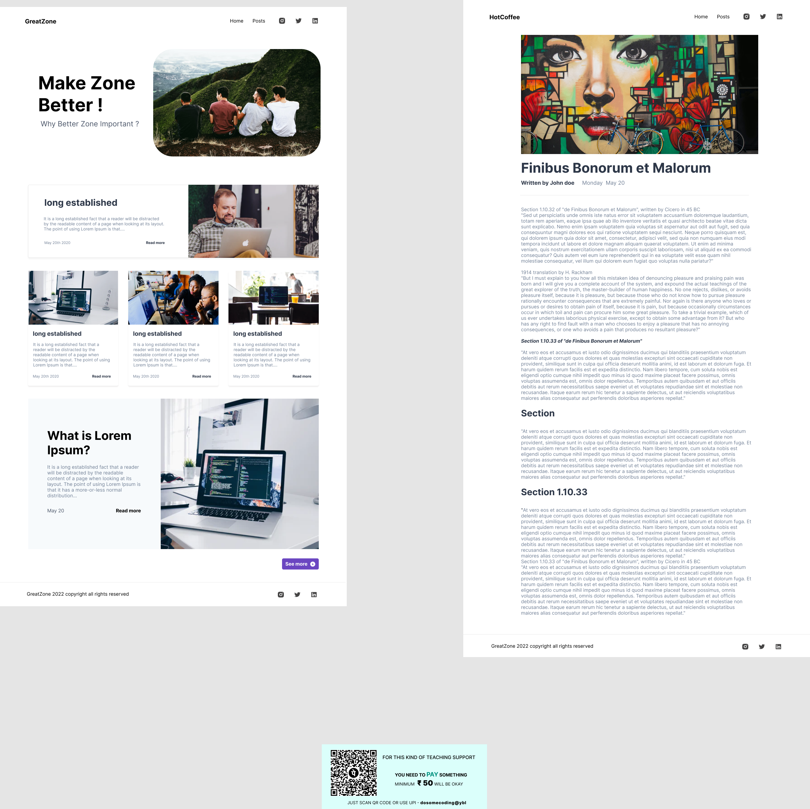

# Blog-Web-Design-Frontend-web-Practise
It will helps you to get knowledge of challenges by Frontend Mentor 

# Blog Website

This is a simple blog website with two pages: Home Page and Post Page. The website is designed to provide information about various topics, and users can navigate between different posts.

## Pages

### Home Page

The home page serves as the landing page for the blog website. It includes the following sections:

- **Header:** The header contains the website logo and navigation menu to navigate between the Home, Posts, and Music pages. It also includes social media icons for Instagram, Twitter, and LinkedIn.

- **Hero Section:** This section features a hero image along with a title and a brief statement about the importance of making the zone better.

- **Long Established Section:** The long established section presents a card with an image and some text explaining the significance of the long-established fact.

- **Cards Section:** This section showcases multiple cards, each featuring an image, title, and a brief description of different posts.

- **Lorem Ipsum Section:** This section displays a card with an image and some text explaining what Lorem Ipsum is.

- **Footer:** The footer contains copyright information and social media icons for Instagram, Twitter, and LinkedIn.

### Post Page

The post page displays an individual blog post in detail. It includes the following sections:

- **Header:** The header is the same as the Home Page, containing the website logo and navigation menu.

- **Hero Section:** The hero section includes an image banner along with the title of the blog post and the name of the author. It also shows the date when the post was written.

- **Main Body Section:** This section contains the main content of the blog post.

- **Section 1.1:** This section presents a subtopic within the blog post.

- **Section 1.2:** This section is another subtopic within the blog post.

- **Footer:** The footer on the Post Page is the same as the Home Page, containing copyright information and social media icons.

## Technologies Used

The website is built using HTML and CSS for layout, design, and responsiveness. It also utilizes the Font Awesome library for social media icons.

## How to View Locally

To view this website locally, follow these steps:

1. Clone the repository.
2. Open the `homePage.html` and `postPage.html` files in your browser.

## Deployment

This project can be deployed using any web hosting service. Some recommended hosting providers include:

- [GitHub Pages](https://pages.github.com/)

## Contributions

Contributions and feedback are welcome! Feel free to open an issue or create a pull request.

## License

This project is licensed under the [MIT License](LICENSE).
